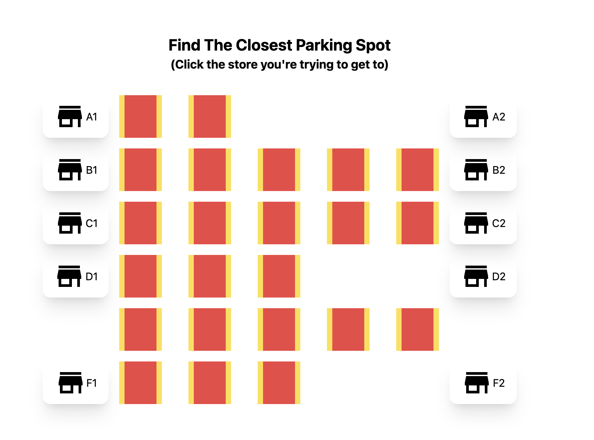

# parking-lot-project
This is a fully containerized, deployable web app to find the shortest distance parking space to your chosen destination in a parking lot.

To run this locally, simply clone the repo and run `docker-compose up` in the root directory.

Then open a browser and visit `http://localhost:3050`

